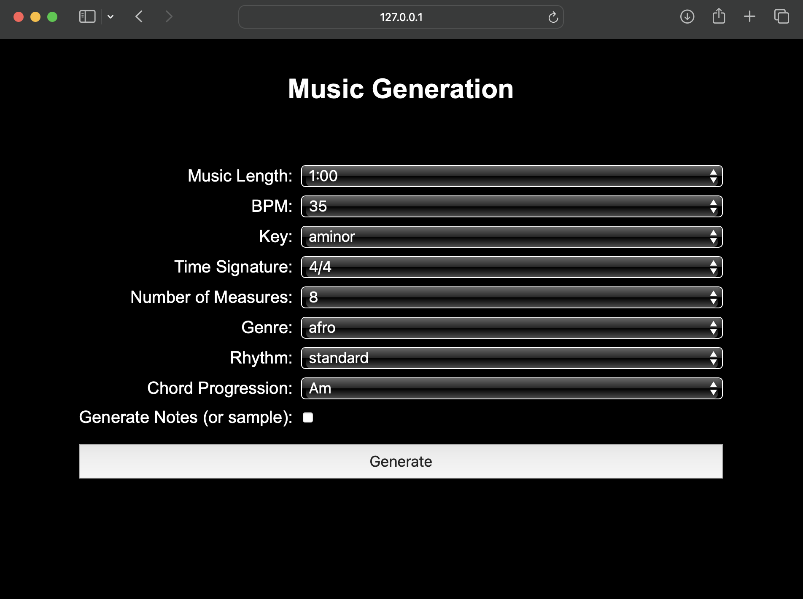
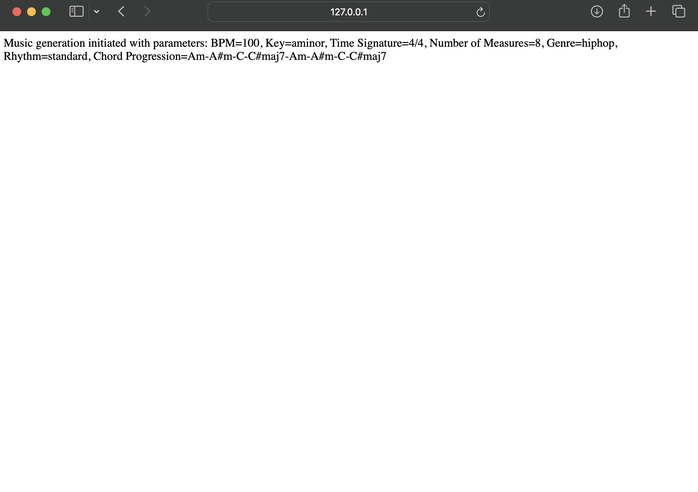

# MusiComb

MusiComb is a program born as an extension of Hyun et al., 2022 ([paper](https://arxiv.org/abs/2211.09385) | [code](https://github.com/POZAlabs/ComMU-code)) and aimed at tackling the *combinatorial music generation* task. 

## Setup

1. Clone the repo and `cd` into its directory:
    ```
    $ git clone https://github.com/alitavanaali/musicomb.git
    $ cd midicomb
    ```

1. Create a virtual environment and install the required packages:
    ```
    $ python -m venv .venv
    $ source .venv/bin/activate
    $ pip install -r requirements.txt
    ```

1. Unzip the dataset:
    ```
    $ tar -xvf dataset/commu_midi.tar -C dataset/
    $ unzip dataset/groove_drum.zip -d dataset/
    ```
    You should get the following directory structure:
    ```
    dataset
    ├── commu_meta.csv
    ├── groove_drum
    │   ├── drummer1
    │   ├── drummer2
    │   ├── ...
    │   ├── drummer10
    ├── commu_midi
    │   ├── train
    │   │   └── raw
    │   │       └── midifiles(.mid)
    │   └── val
    │       └── raw
    │           └── midifiles(.mid)
    ├── commu_midi.tar
    └── README.md
    ```

1. **[OPTIONAL]** If you want the samples to be generated (see the following section), download the model weights from [here](https://drive.google.com/file/d/1y0wl9JO8od3pLOMSxN8NwLy1PCJCyTGL/view?usp=share_link) and move them into the [`ckpt`](ckpt) directory:
    ```
    ckpt
    ├── checkpoint_best.pt
    └── README.md
    ```
    **Note:** the weights are provided by Hyun et al. together with their implementation.

## Run

Run `app.py` with its required arguments, e.g.
```
$ python app.py
```
Then you can open [[127](http://127.0.0.1:5000)](http://127.0.0.1:5000) in your browser to open the user interface of the application.



Once the program successfully terminates you will see screen below:



and then, you will find an `out` directory with the following structure:
```
out
└── <date>_<time>
    ├── metadata.yaml
    └── tune.mid
    └── tune_notmerged_sounds.mid
```
where `metadata.yaml` contains the arguments of the corresponding run and `tune.mid` is the generated MIDI file and 'tune_notmerged_sounds.mid' is separated tracks version.
